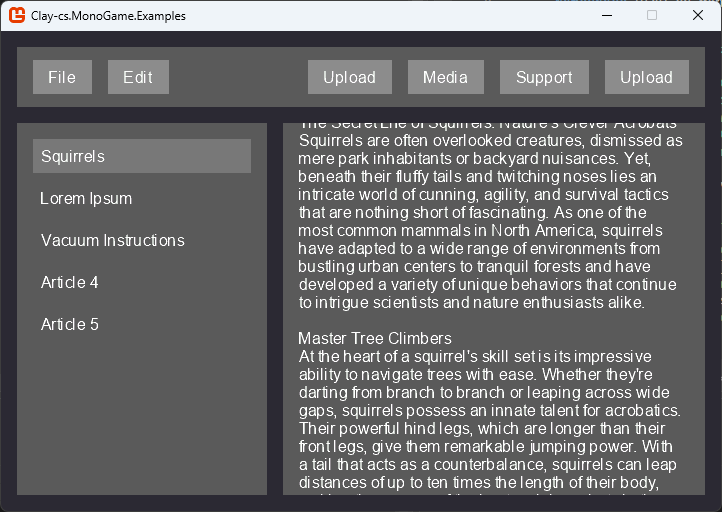
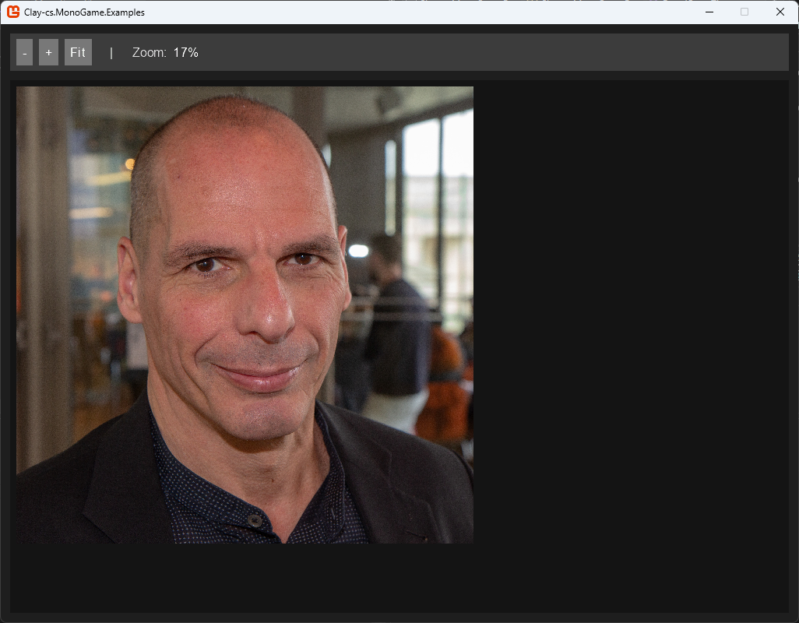
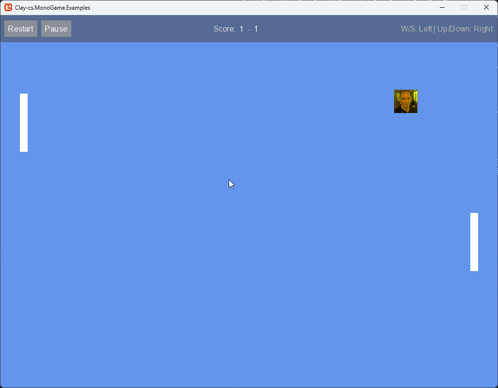

todo:
- rounded corners
- figure out better way to do fonts

# Clay.MonoGame

A MonoGame renderer for the [csharp bindings](https://github.com/Orcolom/clay-cs) for [Clay.h](https://github.com/nicbarker/clay)

This README will focus on the MonoGame specifics, for more complete documentation pages check out the [Clay Github](https://github.com/nicbarker/clay) or the [Clay-cs Github](https://github.com/Orcolom/clay-cs)

To stay in alignment with the original Clay, Clay-cs.MonoGame is meant to be very limited in scope, only containing the basic functionality to render as well as helpers/utils to reduce SOME boilderplating. This is far from a proper and fuller "UI Library" for MonoGame, but in its bare boniness, It is fully intended to be used to create the one ideal for any given project (of any level of complexity, as this can be used as-is, or greatly expanded to meet requirements or fit with current code.) 








---

# Quick Start


```cs

public class QuickStart : Game
{
    private GraphicsDeviceManager _graphics;
    private SpriteBatch _spriteBatch;

    // clay boilerplate
    private ClayArenaHandle _arena;
    //private ClayStringCollection _clayStrings = new ClayStringCollection();
    //private ClayTexture2DCollection _clayTextures = new ClayTexture2DCollection();
    //private CustomRenderRegister _customRenderers = new CustomRenderRegister();
    private Texture2D _texturePrimitive;
    Stack<ScissorFrame> _scissorStack = new Stack<ScissorFrame>();
    private int _prevWheel;// Needed for mouse wheel delta calculation

    public QuickStart()
    {
        _graphics = new GraphicsDeviceManager(this);
        Content.RootDirectory = "Content";
    }

    protected override void Initialize()
    {
        _graphics.PreferredBackBufferWidth = 1024;
        _graphics.PreferredBackBufferHeight = 768;
        _graphics.ApplyChanges();
        IsMouseVisible = true;
        base.Initialize();
    }

    protected override unsafe void LoadContent()
    {
        _spriteBatch = new SpriteBatch(GraphicsDevice);

        // white pixel needed for rendering
        _texturePrimitive = new Texture2D(GraphicsDevice, 1, 1);
        _texturePrimitive.SetData(new[] { Color.White });
        MonoGameClay.Fonts[0] = Content.Load<SpriteFont>("myfont");

        uint requiredSize = Clay.MinMemorySize();
        _arena = Clay.CreateArena(requiredSize);
        Clay.Initialize(_arena, new Clay_Dimensions(
            GraphicsDevice.Viewport.Width,
            GraphicsDevice.Viewport.Height),
            data => Debug.WriteLine($"{data.errorType}: {data.errorText.ToCSharpString()}")
        );

        Clay.SetMeasureTextFunction(MonoGameClay.MeasureText);
    }

    protected override void Update(GameTime gameTime)
    {
        if(GamePad.GetState(PlayerIndex.One).Buttons.Back == ButtonState.Pressed || Keyboard.GetState().IsKeyDown(Keys.Escape))
            Exit();

        // # Boilerplate Feed mouse into clay
        var mouse = Mouse.GetState();
        int wheelDelta = mouse.ScrollWheelValue - _prevWheel;
        _prevWheel = mouse.ScrollWheelValue;
        Clay.SetPointerState(new System.Numerics.Vector2(mouse.X, mouse.Y), mouse.LeftButton == ButtonState.Pressed);
        var dt = (float)gameTime.ElapsedGameTime.TotalSeconds;
        Clay.UpdateScrollContainers(true, new System.Numerics.Vector2(0, wheelDelta / 60f), dt);

        base.Update(gameTime);
    }

    protected override void Draw(GameTime gameTime)
    {
        GraphicsDevice.Clear(Color.CornflowerBlue);
        Clay.SetLayoutDimensions(new Clay_Dimensions(GraphicsDevice.Viewport.Width, GraphicsDevice.Viewport.Height));

        Clay.BeginLayout();
        using(Clay.Element(new()
        {
            backgroundColor = new Clay_Color(255, 0, 0),
            layout = new()
            {
                sizing = new Clay_Sizing(Clay_SizingAxis.Fixed(200), Clay_SizingAxis.Fixed(200))
            }
        }));
        var commands = Clay.EndLayout();
        MonoGameClay.RenderCommands(commands, GraphicsDevice, _spriteBatch, _texturePrimitive, _scissorStack);

        base.Draw(gameTime);
    }
}


```

---

# Install

Make sure you have monogame installed.

remember to also `git clone --recurse-submodules https://github.com/CarsonDDD/Clay-cs.MonoGame.git` if you want access to the library

Add `Clay-cs.MonoGame.csporj` as a package reference or build the library yourself to add the dll

